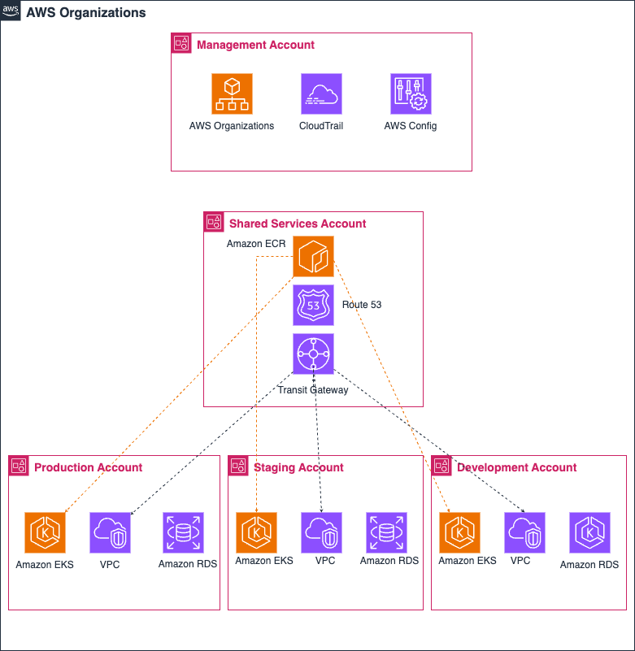
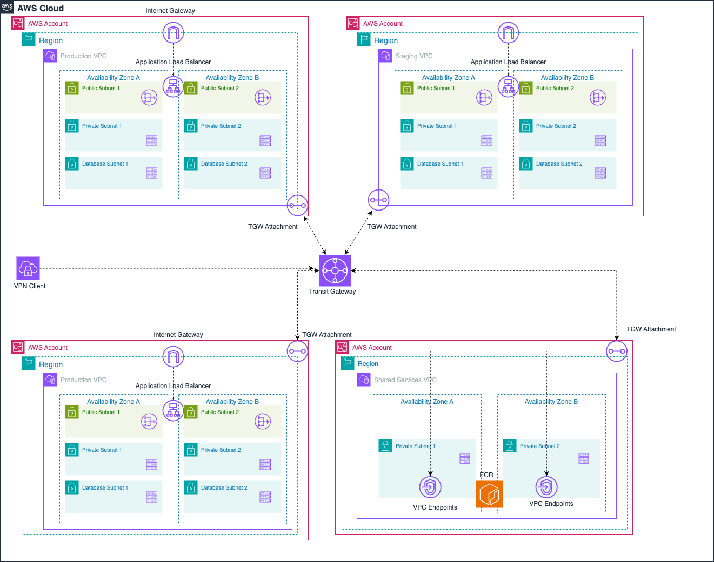
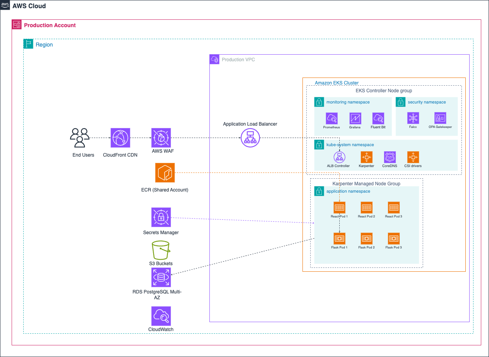

# Cloud Architecture Documentation

## Executive Summary

This document provides a comprehensive cloud architecture design for the client's web application platform, focusing on four critical areas: Cloud Environment Structure, Network Design, Compute Platform, and Database Architecture. The design is built on Amazon Web Services (AWS) and optimized for scalability, security, and operational excellence.

## Cloud Provider Selection: AWS vs Google Cloud Platform

### Why Amazon Web Services (AWS) Was Selected

After thorough evaluation of both AWS and Google Cloud Platform (GCP), **Amazon Web Services** was selected as the primary cloud provider for the client's infrastructure. This decision is based on comprehensive analysis across technical capabilities, business requirements, cost considerations, and strategic factors.

#### 1. **Enterprise-Grade Multi-Account Strategy**

**AWS Organizations Capabilities:**
- **AWS Organizations** provides mature, battle-tested multi-account management with fine-grained billing, service control policies (SCPs), and centralized governance
- **Complete Account Isolation** ensures true resource separation between environments (Dev, Staging, Production, Shared Services, Management)
- **Cross-Account IAM** offers sophisticated role assumption and resource sharing capabilities
- **Consolidated Billing** enables volume discounts, reserved instance sharing, and detailed cost allocation
- **Service Control Policies (SCPs)** can enforce security and compliance policies across all accounts
- **Account-level resource limits** prevent one environment from affecting others
- **Cross-account resource sharing** allows ECR, KMS keys, and other services to be shared securely

**GCP Projects and Organizations:**
- **Google Cloud Projects** serve as the primary resource container, similar to AWS accounts
- **Google Cloud Organizations** provide hierarchical structure but with different capabilities
- **Folders** can group projects but lack the sophisticated policy enforcement of AWS SCPs
- **Billing accounts** can be shared across projects but without the granular controls of AWS
- **IAM inheritance** works through the hierarchy but is less mature than AWS cross-account roles
- **Resource sharing** between projects requires different mechanisms and is less streamlined
- **Project-level isolation** is good but not as comprehensive as AWS account-level separation

**Key Differences for Enterprise Management:**
- **Policy Enforcement**: AWS SCPs provide preventive controls that can block actions across accounts, while GCP relies more on detective controls
- **Billing Granularity**: AWS provides more detailed cost allocation and chargeback capabilities per account
- **Resource Isolation**: AWS accounts provide stronger isolation boundaries compared to GCP projects
- **Cross-Environment Access**: AWS cross-account IAM is more mature and flexible than GCP's cross-project mechanisms

#### 2. **Container Orchestration and Cost Optimization**

**AWS Amazon EKS Capabilities:**
- **Deep AWS Integration**: Native integration with VPC networking, IAM, CloudWatch, Application Load Balancer, and over 150+ AWS services
- **Karpenter for Intelligent Provisioning**: Advanced node provisioning that automatically selects optimal instance types, availability zones, and purchase options based on workload requirements
- **Sophisticated Spot Instance Management**: Karpenter can intelligently mix On-Demand and Spot instances, achieving 50-70% cost savings while maintaining availability
- **Node Pool Flexibility**: Supports multiple node groups with different instance types, allowing optimization for system components vs application workloads
- **Advanced Autoscaling**: Works seamlessly with Horizontal Pod Autoscaler (HPA), Vertical Pod Autoscaler (VPA), and Cluster Autoscaler
- **Security Features**: Pod Security Standards, network policies, Secrets Store CSI Driver integration
- **Monitoring Integration**: Deep CloudWatch integration with container insights and application performance monitoring

**Google Cloud GKE Capabilities:**
- **GKE Autopilot**: Fully managed Kubernetes experience where Google manages nodes, but with less flexibility for custom configurations
- **GKE Standard**: More control over node configuration but requires more operational overhead
- **Preemptible Instance Management**: Cost optimization through preemptible instances, but less sophisticated than Karpenter's multi-instance-type approach
- **Google Cloud Integration**: Native integration with Google Cloud services like Cloud Storage, Cloud SQL, and Stackdriver
- **Binary Authorization**: Container image security and compliance enforcement
- **Anthos**: Multi-cloud and hybrid Kubernetes management platform

**Key Differences for Enterprise Decision-Making:**
- **Cost Optimization Sophistication**: Karpenter's intelligent instance selection provides superior cost optimization compared to GKE's more basic preemptible instance approach
- **Flexibility vs Simplicity**: AWS EKS offers more granular control for complex enterprise requirements, while GKE Autopilot prioritizes simplicity over customization
- **Ecosystem Maturity**: AWS has a larger third-party ecosystem of Kubernetes operators and tools specifically built for EKS
- **Multi-Cloud Strategy**: GKE Autopilot can be limiting for multi-cloud strategies due to Google-specific abstractions

#### 3. **Networking and Global Infrastructure**

**AWS Networking Capabilities:**
- **AWS Transit Gateway**: Highly scalable hub-and-spoke networking that can connect thousands of VPCs and on-premises networks with centralized routing control
- **Sophisticated Routing Control**: Route tables, route propagation, and network segmentation with fine-grained traffic control between environments
- **VPC Peering**: Mature cross-region and cross-account connectivity with advanced filtering and security controls
- **AWS PrivateLink**: Secure service-to-service communication without internet exposure, supporting both AWS services and custom applications
- **Global Infrastructure**: 37 regions and 117 availability zones with 1,600+ edge locations for CloudFront CDN
- **AWS Direct Connect**: Dedicated network connections with multiple virtual interfaces and BGP routing control
- **Network Load Balancer**: High-performance Layer 4 load balancing with static IP addresses and ultra-low latency
- **Application Load Balancer**: Advanced Layer 7 routing with SSL termination, sticky sessions, and WebSocket support

**Google Cloud Networking Capabilities:**
- **VPC Network Peering**: Direct connectivity between VPC networks, but requires mesh topology for complex multi-network connectivity
- **Shared VPC**: Centralized network management where one project owns the network and shares subnets with other projects
- **Cloud Interconnect**: Dedicated connectivity to Google Cloud with lower latency than internet-based connections
- **Global Load Balancing**: Anycast IP addresses that route traffic to the nearest healthy backend globally
- **Cloud CDN**: Global content delivery network integrated with Google's global infrastructure
- **Premium vs Standard Network Tiers**: Choice between Google's premium global network or standard internet routing
- **Global Infrastructure**: 40+ regions and 121+ zones, but significantly fewer edge locations (140+ vs AWS's 1,600+)

**Key Differences for Enterprise Decision-Making:**
- **Network Architecture Complexity**: AWS Transit Gateway provides superior centralized control for complex multi-account, multi-region architectures compared to GCP's mesh approach
- **Hybrid Cloud Connectivity**: AWS Direct Connect offers more mature and flexible hybrid cloud networking options with better enterprise integration
- **Security Isolation**: AWS account-based isolation combined with Transit Gateway route tables provides stronger network security boundaries
- **Global Reach**: AWS has significantly more edge locations (1,600+ vs ~140 for Google), providing superior global performance for content delivery
- **Enterprise Network Integration**: AWS networking services integrate better with traditional enterprise networking equipment and practices

#### 4. **Database Services and Management**

**AWS Database Services Capabilities:**
- **Amazon RDS PostgreSQL**: Fully managed database with Multi-AZ deployments, automated failover, and comprehensive read replica management across regions
- **Performance Insights**: Advanced database performance monitoring with query-level analysis, wait event analysis, and optimization recommendations
- **AWS Backup**: Centralized backup management across all AWS services with cross-region replication and compliance reporting
- **Cross-Region Disaster Recovery**: Sophisticated automated disaster recovery with multi-region replication and automated failover procedures
- **Parameter Groups**: Granular database configuration management with environment-specific tuning
- **Security Features**: Encryption at rest and in transit, IAM database authentication, and VPC security groups
- **Scaling Options**: Vertical scaling with minimal downtime, read replica scaling, and automated storage scaling
- **Maintenance Windows**: Flexible maintenance scheduling with automated patching and version upgrades
- **Comprehensive Monitoring**: CloudWatch integration with custom metrics, alarms, and automated response actions

**Google Cloud Database Services Capabilities:**
- **Cloud SQL**: Managed PostgreSQL, MySQL, and SQL Server with high availability and automatic failover
- **Regional Persistent Disks**: Cross-zone replication for high availability within a region
- **Point-in-Time Recovery**: Restore to any point within the retention period (up to 365 days)
- **Cloud SQL Insights**: Query performance monitoring and optimization recommendations
- **Backup and Recovery**: Automated backups with flexible scheduling and retention policies
- **Read Replicas**: Cross-region read replicas for read scaling and disaster recovery
- **Private IP**: VPC-native connectivity without exposing databases to the public internet
- **IAM Integration**: Google Cloud IAM for database access control
- **Maintenance Windows**: Configurable maintenance windows for updates and patches

**Key Differences for Enterprise Decision-Making:**
- **Multi-AZ vs Regional Availability**: AWS Multi-AZ provides synchronous replication with automatic failover, while Cloud SQL relies on regional persistent disks which may have longer failover times
- **Performance Monitoring Depth**: AWS Performance Insights offers more granular query-level analysis and historical performance data compared to Cloud SQL Insights
- **Disaster Recovery Automation**: AWS provides more sophisticated cross-region disaster recovery automation with better failover capabilities and data protection
- **Enterprise Integration**: AWS RDS integrates better with enterprise monitoring and management tools through CloudWatch and AWS Config
- **Backup Flexibility**: AWS offers more comprehensive backup strategies including cross-service backup management through AWS Backup
- **Scaling Sophistication**: AWS provides more granular scaling options including automated storage scaling and more flexible read replica management

#### 5. **Security and Compliance Framework**

**AWS Security and Compliance Capabilities:**
- **AWS IAM**: Industry-leading identity and access management with fine-grained permissions, role assumption, attribute-based access control (ABAC), and comprehensive policy simulation
- **Comprehensive Audit and Governance**: CloudTrail for API logging, AWS Config for resource compliance, Security Hub for centralized security findings, and AWS Well-Architected Framework guidance
- **Extensive Compliance Certifications**: 143+ security standards including SOC 1/2/3, PCI DSS Levels 1-4, HIPAA, FedRAMP, GDPR, ISO 27001/27017/27018, and industry-specific certifications
- **Advanced Threat Detection**: GuardDuty for intelligent threat detection, Macie for data discovery and protection, and Inspector for application security assessment
- **Network Security**: VPC Flow Logs, AWS WAF with advanced rules, AWS Shield for DDoS protection, and Network Firewall for traffic filtering
- **Data Protection**: KMS for encryption key management, Secrets Manager for credential rotation, and Certificate Manager for SSL/TLS certificates
- **Enterprise Security Tools Integration**: Native integration with Splunk, CrowdStrike, Rapid7, and 100+ other enterprise security platforms
- **Incident Response**: Automated incident response through Security Hub, CloudWatch Events, and Lambda integrations

**Google Cloud Security and Compliance Capabilities:**
- **Cloud IAM**: Role-based access control with custom roles, service accounts, and organizational policies
- **Security Command Center**: Centralized security findings and asset discovery across Google Cloud resources
- **Compliance Coverage**: Strong compliance certifications including SOC 1/2/3, ISO 27001, PCI DSS, HIPAA, and GDPR compliance
- **Chronicle Security Operations**: Google's security analytics platform for threat hunting and investigation
- **VPC Security**: VPC Flow Logs, Cloud Armor for DDoS protection, and Identity-Aware Proxy for application access control
- **Binary Authorization**: Container image security and compliance verification
- **Cloud KMS**: Encryption key management with Hardware Security Module (HSM) support
- **Security Scanning**: Container Analysis for vulnerability scanning and Web Security Scanner for application testing
- **BeyondCorp**: Zero-trust security model for enterprise access

**Key Differences for Enterprise Decision-Making:**
- **IAM Granularity and Flexibility**: AWS IAM provides more granular permissions and sophisticated cross-account role mechanisms compared to Google Cloud IAM
- **Compliance Ecosystem Maturity**: AWS has a more mature compliance ecosystem with more third-party auditing tools and compliance automation
- **Security Tool Integration**: AWS has significantly more native integrations with enterprise security tools and SIEM platforms
- **Audit and Governance Depth**: AWS provides more comprehensive audit trails and governance tools through CloudTrail, Config, and Organizations
- **Threat Detection Sophistication**: AWS GuardDuty uses machine learning and threat intelligence feeds that are more mature than Google's equivalent services
- **Enterprise Security Architecture**: AWS security services are designed specifically for complex enterprise environments with multi-account strategies

#### 6. **Risk Mitigation and Vendor Lock-in Prevention**

**Multi-Cloud Strategy:**
- **Kubernetes-First Approach** using EKS ensures application portability across cloud providers
- **Open Source Tools** (Prometheus, Grafana, ArgoCD) can run on any cloud platform
- **Infrastructure as Code** with Terraform modules designed for multi-cloud deployment
- **Container Strategy** using Docker ensures cloud-agnostic application architecture

This strategic approach minimizes vendor lock-in while maximizing the benefits of AWS's mature services and ecosystem.

**Note on Technical Currency:**
All technical specifications, version numbers, and infrastructure counts in this document have been updated to reflect the latest available as of June 2025, including Kubernetes 1.33, PostgreSQL 17.5, AWS's 37 regions with 117 availability zones, 1,600+ CloudFront edge locations, and Graviton4 instance types for optimal performance and cost efficiency.

## Cloud Environment Structure

### Multi-Account Strategy Recommendation

**Recommended Architecture: 5 AWS Accounts**

We recommend a **5-account AWS architecture** using AWS Organizations for centralized management and governance. This approach provides optimal isolation, security, and cost management for the client's requirements.

*Figure 1: AWS Multi-Account Organization Structure with 5 Accounts*

#### Account Structure:

1. **Management Account**
   - **Purpose**: AWS Organizations root, consolidated billing, security policies
   - **Resources**: AWS Organizations, CloudTrail (organization-wide), Cost and Billing
   - **Access**: Limited to senior DevOps/Platform team members only
   
2. **Shared Services Account**
   - **Purpose**: Centralized services shared across environments
   - **Resources**: Amazon ECR, CI/CD tools, DNS (Route 53), monitoring dashboards
   - **Access**: DevOps team, automated CI/CD pipelines
   
3. **Production Account**
   - **Purpose**: Live customer-facing environment
   - **Resources**: EKS cluster, RDS databases, production workloads
   - **Access**: Restricted to senior engineers, automated deployments only
   
4. **Staging Account**
   - **Purpose**: Pre-production testing and QA environment
   - **Resources**: EKS cluster, RDS databases, testing infrastructure
   - **Access**: Development team, QA team, automated testing
   
5. **Development Account**
   - **Purpose**: Development and experimentation environment
   - **Resources**: EKS cluster, development databases, sandbox resources
   - **Access**: Full development team access

#### Justification for AWS vs GCP Projects:

**AWS Organizations Advantages:**
- **Service Control Policies (SCPs)**: Centralized governance with fine-grained permission boundaries
- **Consolidated Billing**: Volume discounts, Reserved Instance sharing across accounts
- **Resource Isolation**: Complete network and security isolation between environments
- **Cross-Account IAM**: Sophisticated role assumption for secure resource sharing

**GCP Projects Comparison:**
- Google Cloud uses Projects within Organizations, but lacks the mature cross-project governance
- Limited organizational-level policy enforcement compared to AWS SCPs
- Less sophisticated billing allocation and resource sharing capabilities

#### Implementation Benefits:

**Security Benefits:**
- Complete resource isolation between environments
- Blast radius limitation (compromise in dev doesn't affect prod)
- Granular access control with cross-account roles
- Audit trail separation for compliance

**Operational Benefits:**
- Clear cost allocation per environment
- Independent scaling and resource limits
- Simplified disaster recovery (account-level backup/restore)
- Environment-specific policies and configurations

**Financial Benefits:**
- Reserved Instance sharing across production accounts
- Volume discounts through consolidated billing
- Detailed cost tracking and chargeback capabilities
- Budget controls per account with automated alerts

## Network Design

### VPC Architecture

**Hub-and-Spoke Architecture with Transit Gateway**

Our network design implements a centralized hub-and-spoke model using AWS Transit Gateway, providing scalable and secure connectivity across all environments.

*Figure 2: Hub-and-Spoke Network Architecture with Transit Gateway*

#### Network Security Implementation:

**1. Transit Gateway Route Tables**
- Production isolation - no direct communication with dev/staging
- Shared services accessible from all environments
- Centralized routing management and traffic inspection
- Environment-specific route tables for security isolation

**2. Security Groups (Defense in Depth)**

**Application Layer Security Groups:**
- **ALB Security Group**: Inbound HTTPS/HTTP from internet, Outbound to EKS workers
- **EKS Worker Security Group**: Inbound from ALB and bastion, Outbound to ECR and database
- **Database Security Group**: Inbound from EKS workers only, No outbound (deny all)
- **Bastion Security Group**: Inbound SSH from company IPs only, Outbound to EKS workers

**3. Network Access Control Lists (NACLs)**

**Private Subnet NACL:**
- Allow HTTP/HTTPS from public subnets
- Allow PostgreSQL from private subnets only
- Allow ephemeral ports for return traffic
- Explicit deny rules for known malicious IPs

**4. Web Application Firewall (WAF)**

**AWS WAF Rules:**
- **SQL Injection Protection**: Block requests with SQL injection patterns, configurable rate limiting per IP
- **DDoS Protection**: AWS Shield Standard (automatic), CloudFront integration, rate limiting at ALB level
- **Geo-blocking**: Allow specific countries based on business requirements, block known malicious regions
- **Bot Protection**: Challenge suspected bot traffic, allow legitimate crawlers

#### Network Monitoring and Logging:

**VPC Flow Logs:**
- Destination: CloudWatch Logs
- Capture: ALL traffic (accepted and rejected)
- Retention: Configurable based on compliance requirements
- Analysis: Automated anomaly detection

**Network Performance Monitoring:**
- VPC Reachability Analyzer for connectivity testing
- Transit Gateway Network Insights for traffic analysis
- CloudWatch Network Monitoring for bandwidth metrics

## Compute Platform

### Kubernetes Service Implementation

**Amazon EKS with Karpenter for Intelligent Node Management**

Our compute platform leverages Amazon EKS (Elastic Kubernetes Service) with Karpenter for advanced node provisioning and cost optimization.

*Figure 3: Application Architecture on Amazon EKS with Karpenter Node Management*

#### EKS Cluster Architecture:

**EKS Cluster Configuration:**
- Kubernetes Version: 1.33 (latest stable)
- Endpoint Access: Private (VPC-only access)
- Logging Enabled: API, Audit, Authenticator, ControllerManager, Scheduler
- Add-ons: VPC CNI, CoreDNS, kube-proxy, AWS Load Balancer Controller, EBS CSI Driver, EFS CSI Driver

#### Karpenter Node Provisioning Strategy:

**1. Control Plane NodeGroup (EKS Managed)**
- Node Type: On-demand instances only
- Purpose: Karpenter controller, AWS Load Balancer Controller, CSI drivers, system components
- Management: Managed by EKS (not Karpenter)
- Scaling: Fixed size, minimal resource requirements

**2. Karpenter-Managed NodePools (Application Workloads)**
- **General Purpose Pool**: Mixed on-demand and spot instances, multiple instance families
- **Compute Optimized Pool**: Graviton4-based instances for CPU-intensive workloads (40% cost savings)
- **Memory Optimized Pool**: For memory-intensive applications and caching layers
- **Spot Instance Pool**: Cost-optimized workloads with interruption tolerance
- **Architecture Support**: AMD64 and ARM64 with intelligent instance type selection
- **Scaling**: Automatic provisioning based on pod requirements and cost optimization

#### Scaling and Resource Allocation:

**Horizontal Pod Autoscaling (HPA):**
- CPU and Memory based autoscaling thresholds
- Minimum replicas maintained for high availability
- Maximum replicas set based on capacity planning
- Gradual scale down to prevent service disruption
- Rapid scale up to handle traffic spikes

**Resource Management:**
- **Dynamic Resource Allocation**: Resource requests and limits determined based on application profiling
- **Right-sizing**: Continuous optimization based on monitoring and usage patterns
- **Quality of Service**: Guaranteed resources for critical components, burstable for applications

#### Scaling for High Traffic (Millions of Users):

**Infrastructure Scaling Strategy:**
- **Multi-Region Deployment**: Distribute traffic across multiple AWS regions for global performance
- **Auto Scaling Groups**: Karpenter automatically provisions nodes based on demand patterns
- **Load Balancing**: Application Load Balancer with sticky sessions and intelligent routing
- **CDN Integration**: CloudFront for static content delivery and edge caching
- **Database Scaling**: Read replicas across regions with intelligent read/write splitting

**Application Architecture for Scale:**
- **Microservices Design**: Independent scaling of application components
- **Caching Strategy**: Redis/ElastiCache for session management and application caching
- **Rate Limiting**: Application-level rate limiting and throttling for API protection
- **Message Queues**: SQS/SNS for asynchronous processing and decoupling
- **Event-Driven Architecture**: Lambda functions for serverless scaling of background tasks

**Performance Optimization:**
- **Container Optimization**: Multi-stage builds, minimal base images, and efficient resource utilization
- **Database Performance**: Connection pooling, query optimization, and intelligent sharding
- **Monitoring and Observability**: Real-time metrics, distributed tracing, and automated alerting
- **Cost Management**: Spot instance integration, reserved capacity, and resource optimization

### Containerization Strategy

#### Container Image Building and Security:

**Multi-Stage Dockerfile Strategy:**
- Build stage: Dependencies and compilation
- Security scanning stage: Vulnerability assessment
- Production stage: Minimal runtime with non-root user

**Security Best Practices:**
- Non-root user execution
- Minimal base images (distroless/alpine)
- No package managers in production images
- Security scanning in CI pipeline

#### Container Registry Strategy:

**Amazon ECR Configuration in Shared Services Account:**
- Image Tag Mutability: IMMUTABLE
- Scan on Push: Enabled
- Cross-account access policies
- Lifecycle policies for automatic cleanup

**Image Lifecycle Management:**
- Retain recent production images based on release frequency
- Clean up untagged images regularly
- Archive old images to reduce storage costs
- Cross-region replication for DR

#### CI/CD Pipeline for Container Deployment:

**GitHub Actions Workflow:**
- Trigger on push to main/develop branches
- AWS OIDC authentication (no stored credentials)
- Build and scan images with Trivy
- Push to ECR with semantic versioning
- Automated deployment trigger to ArgoCD

#### Kubernetes Deployment Strategy:

**Blue-Green Deployment with ArgoCD:**
- Zero-downtime deployments
- Automated rollback on failure
- Pre/post deployment analysis
- Canary analysis for production
- GitOps workflow for all changes

## Database

### PostgreSQL Service Recommendation

**Amazon RDS PostgreSQL Multi-AZ with Read Replicas**

We recommend **Amazon RDS PostgreSQL** with Multi-AZ deployment as the optimal database solution for the client, providing managed database services with high availability, automated backups, and seamless scaling capabilities.

#### Justification for RDS PostgreSQL:

**Technical Advantages:**
- **Managed Service**: Automated patching, maintenance, and monitoring
- **Multi-AZ Deployment**: Automatic failover with <60 seconds downtime
- **Read Replicas**: Scale read operations across multiple regions
- **Performance Insights**: Advanced query performance monitoring and optimization
- **Automated Backups**: Point-in-time recovery with up to 35 days retention

**Alternative Comparison:**

**Amazon RDS vs Self-Managed PostgreSQL:**
- RDS provides 99.95% uptime SLA with Multi-AZ
- Automated security patching reduces operational overhead
- Built-in monitoring and alerting
- Simplified backup and recovery procedures
- Managed read replica deployment and failover

**Google Cloud SQL vs Amazon RDS:**
- Better integration with AWS ecosystem
- More comprehensive backup options
- Superior cross-region read replica capabilities
- More granular performance monitoring
- Better disaster recovery automation

#### Database Architecture per Environment:

**Production Environment:**
- **Primary Database**: PostgreSQL 17.5, appropriately sized based on application requirements
- **Multi-AZ**: Enabled with synchronous replication for automatic failover
- **Read Replicas**: Multiple same-region replicas + cross-region replica for disaster recovery
- **Storage**: Auto-scaling gp3 SSD with performance optimization
- **Connection Pooling**: PgBouncer for efficient connection management
- **Backup Retention**: Extended retention with point-in-time recovery

**Staging Environment:**
- **Primary Database**: PostgreSQL 17.5, sized for testing workloads
- **Multi-AZ**: Enabled for production-like testing
- **Read Replicas**: Available for read scaling validation
- **Backup Retention**: Standard retention period

**Development Environment:**
- **Primary Database**: PostgreSQL 17.5, minimal sizing for development
- **Multi-AZ**: Disabled for cost optimization
- **Read Replicas**: None
- **Backup Retention**: Minimal retention period

#### Database Security Configuration:

**Security Groups:**
- Inbound: Database port from EKS workers and bastion only
- Outbound: None (default deny)

**Encryption:**
- At Rest: AWS KMS encryption enabled
- In Transit: SSL/TLS enforced
- Key Management: Customer-managed keys for production

**Parameter Groups:**
- Custom parameter groups optimized for application workload characteristics
- Query logging and performance monitoring configuration
- Connection limits based on application requirements and instance capacity
- Memory and performance optimizations tailored to usage patterns

### Backup Strategy

#### Automated Backup Configuration:

**RDS Automated Backups:**
- **Production**: Extended retention, frequent snapshots, cross-region copy
- **Staging**: Standard retention, daily snapshots
- **Development**: Minimal retention, daily snapshots
- **Point-in-Time Recovery**: Fine granularity for production environments

**Manual Backup Strategy:**
- Manual snapshots before major deployments
- Extended retention for compliance requirements
- Cross-region replication for disaster recovery
- Automated testing of backup restoration

**Application-Level Backups:**
- Regular full database dumps using pg_dump
- Storage in S3 with lifecycle policies
- Transition to Glacier based on access patterns
- Long-term retention for compliance requirements

### High Availability Architecture

#### Multi-AZ Deployment Strategy:

**High Availability Components:**
- **Primary Database**: Active instance with synchronous standby
- **Standby Database**: Synchronous replica with automatic failover capability
- **Read Replicas**: Distributed across availability zones and regions
- **Failover**: Automatic detection and promotion with minimal downtime
- **Data Protection**: Zero data loss with synchronous replication

#### Connection Management and Failover:

**Application Connection Configuration:**
- Primary endpoint for write operations
- Read-only endpoint for read traffic distribution
- Connection pooling with PgBouncer
- Automatic retry logic for transient failures
- Regular health checks for connection validation

#### Health Monitoring and Alerting:

**CloudWatch Monitoring:**
- **Performance Metrics**: CPU, memory, and I/O utilization monitoring
- **Database Connections**: Connection pool monitoring and alerting
- **Replication Health**: Lag monitoring and replica status tracking
- **Storage Management**: Auto-scaling triggers and capacity planning
- **Failover Detection**: Automated incident response and notification

### Disaster Recovery Strategy

#### High Availability and Disaster Recovery:

**High Availability Configuration:**
- **Multi-AZ Deployment**: Synchronous replication with automatic failover
- **Read Replicas**: Multiple replicas for read scaling and failover scenarios
- **Automated Monitoring**: CloudWatch alarms for proactive issue detection
- **Connection Management**: Automatic retry logic and health checks

**Disaster Recovery Strategy:**
- **Cross-Region Replication**: Asynchronous read replicas in secondary region
- **Automated Backups**: Continuous backup with point-in-time recovery capability
- **Failover Procedures**: Documented manual promotion process for regional failures
- **Data Protection**: Multiple backup strategies including cross-region storage

#### Cross-Region Disaster Recovery:

**DR Region Setup:**
- Cross-region read replica with minimal replication lag
- Matching VPC and security group configuration
- Pre-staged application infrastructure
- DNS failover preparation
- Documented failover procedures

**Failover Process:**
1. Promote read replica to standalone instance
2. Update application DNS endpoints
3. Redirect traffic to DR region
4. Monitor application functionality
5. Plan failback when primary recovers

This architecture provides the client with a robust, scalable, and secure foundation for growth while maintaining operational excellence and cost optimization across all four critical areas.